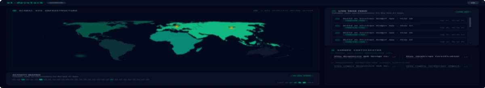

<a href="https://al-devstack.vercel.app" rel="noopener noreferrer">
  
</a>
# al-devstack: Full-Stack GIS Monitoring for freeCodeCamp

A minimalist GIS dashboard and automated scraping pipeline designed to visualize and monitor learning progress on freeCodeCamp in real time.

📋 *Русская версия документации доступна по [этой ссылке](./README.ru.md).*

---

### 🏗️ System Architecture & Data Flow

```
[ freeCodeCamp Profile ] (Target User)
│
▼ (Headless Automation)
[ Parser Engine ] (Python 3.11 / Playwright / Async Core)
│
▼ (Bulk Ops / Upsert)
[ Database Layer ] (MongoDB Atlas / Cluster 'al-devstack')
▲
│ (Mongoose ODM / Aggregation Facets)
[ Backend API Server ] (Node.js / Express 5.2)
▲
│ (REST API / JSON Proxy Routing)
[ Frontend Web App ] (React 19 / Vite 8 / Tailwind v4 / Nginx)
```

---

### 🚀 Quick Start (Infrastructure Orchestration)

The project supports two flexible scenarios for local infrastructure deployment:

#### Option A: Fast Run from Docker Hub (Production-Ready Images)
Ideal for instant dashboard launch without the need to compile source code locally:
```bash
docker compose -f docker-compose.hub.yml up -d
```

#### Option B: Local Build from Source (Development / Build Mode)
Used for active development, customization, and compiling containers directly on your machine:
```bash
docker compose up -d --build
```
*Once launched, the web interface is available at `http://localhost:3000`, and the Backend API is at `http://localhost:5000`.*

---

### 📊 FinOps & Container Optimization

Results of deep environment refactoring and Docker layer optimization (removing redundant dependencies, multi-stage builds, migrating to Alpine images, and isolating Playwright browser engines):

| Service Container | Base Platform / Server | Deployment | Build Type | Initial Size | Optimized Size | Resource Saving |
| :--- | :--- | :--- | :--- | :--- | :--- | :--- |
| **frontend** | Nginx 1.25-alpine | Vercel | Multi-stage | ~450 MB | **48.8 MB** | **-89.1%** |
| **backend** | Node.js 20-alpine | Railway | Multi-stage | ~320 MB | **147.5 MB** | **-53.9%** |
| **parser** | Python 3.11-slim (Bookworm) | GitHub Actions | Single-browser | ~2.9 GB | **1.52 GB** | **-47.5%** |

*Key engineering update: Replaced the bloated default Microsoft Playwright image with a lightweight Python-slim base, completely eliminated Firefox/WebKit browser engines and redundant dependencies, leaving only an isolated headless Chromium instance.*

---

### 🗺️ Future Project Roadmap

#### 1. Core Architecture & Stability
- [ ] **TypeScript Migration**: Full backend and frontend rewrite to strict typing to eliminate compile-time errors.
- [ ] **Cloud-Native Logging**: Integration of lightweight platform logging (Railway & GitHub Actions Streams) with zero performance overhead.
- [ ] **Automated Testing**: Comprehensive integration test coverage for the parser and critical API endpoints via Playwright / Vitest.

#### 2. API Documentation
- [ ] **Swagger / OpenAPI**: Implementation of an interactive API sandbox at `/api-docs` for direct endpoint testing from the browser.

#### 3. Frontend & UX Optimizations
- [ ] **Client-Side Caching**: Integration of TanStack Query (React Query) for smart background GIS data synchronization.
- [ ] **React Error Boundary**: Implementing a lightweight runtime safety net to prevent "white screen" issues on JavaScript crashes.

#### 4. Admin Domain & Dynamic Data
- [ ] **Admin Dashboard**: Admin control panel for on-the-fly modifications of `maxLessons` thresholds following freeCodeCamp curriculum updates.

#### 5. Multi-User Scale & Security
- [ ] **RBAC (Role-Based Access Control)**: Introduction of security roles (Administrator / User).
- [ ] **Multi-User Environment**: Robust authentication and data isolation for up to 10 concurrent users tracking progress by individual nicknames.
- [ ] **Personal Course Reset**: A feature allowing individual users to safely clear their personal progress history in the database without affecting other users' profiles.

<details>
<summary><b>✓ Completed Milestones (Click to expand)</b></summary>

- [x] **Zero-Cost Cloud Architecture**: Designed and deployed a highly stable production environment with a \$0 cloud budget (Vercel + Railway + MongoDB Atlas + GitHub Actions).
- [x] **Orchestration**: Implemented dual-mode container orchestration via `docker-compose` (Local Build / Pre-built Hub Streams).
- [x] **Database Type Fixing**: Resolved MongoDB Atlas String-to-Date data mutation issues to ensure correct timeline feed rendering.
- [x] **Mobile Optimization**: Tailored the dashboard grid layout to fit ultra-small viewport devices like the iPhone SE (`p-4` grid tuning).
- [x] **iPad Pro Adaptive Layout**: Re-aligned grid layout breakpoints (`lg` breakpoint shift) for flawless two-column split-view display on tablets.
- [x] **A11Y Accessibility**: Integrated explicit keyboard focus vectors and `aria-live` screen-reader announcements for enhanced accessibility.
</details>
